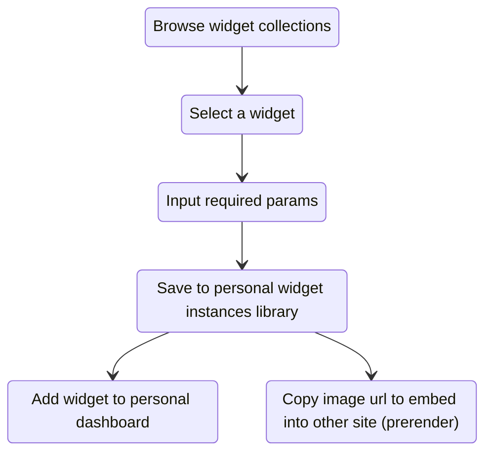

# Widgets RFC

> WIP

## Concepts

1. [Widget](#widget)
    1. Datasource
    2. Visualizations
    3. Parameters
2. [Widget instance](#widget-instance)

### Widget

A widget is a prototype of component contains definition of structured input and visualization.

#### Datasource

Datasource defines where widget get the data. Will support:

- `OSSInsight HTTP API`: can access ossinsight data by HTTP endpoints (predefined SQL) with custom variables.
- `OSSInsight Lite Query`: can access personal data by custom SQL if user has configured OSSInsight Lite database.

#### Visualizations

Widget should provide its visualization method to draw chart or anything on UI. Will support:

- `chartjs`: support use chartjs to draw charts to browser or image file (prerender).

#### Parameters

Widget definition could contain several dynamic parameters to provide UI diversity. User must provide these parameters'
value when creating widget instance.

- `runtime` parameter could be changed when displaying on UI, but not available in datasource definition.
- `non runtime` parameter are immutable outside widget configuration page.

### Widget instance

User can create multiple widget instances from single widget if the widget has dynamic params.

## Detailed design

### Diagrams

#### Create a widget instance

